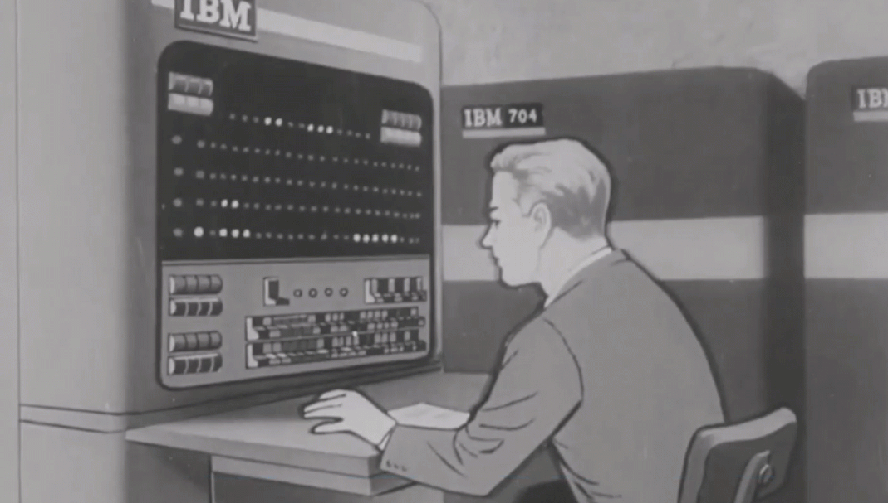

# 💡 Computer Science 50 
CS50 (Computer Science 50) is a comprehensive introduction to computer science, taught by Harvard University. 

### About this repo 
This repository contains my personal notes, based on my understanding of the course. Here, you'll find insights, explanations, and summaries written by me.

---

### CS50: Note
Despite the great content of the course, CS50 will not give you a full explanation of how things work. For instance, in the beginning, you'll learn what a compiler is, what memory addresses are, and so on — but you won’t truly understand how these things work under the hood. For deeper understanding, you’ll need to research and explore on your own.

At this stage, it's unlikely you'll have truly hard questions. They may feel challenging, but most can be answered with a quick Google search. Avoid asking others for help with basic or common questions in computer science (or any other scientific field) — it can be frustrating for them and is often unnecessary.

Even though I’ve tried to make my explanations as clear as possible, I don’t have the patience (and likely, neither will you) to explain how everything works in depth.

##### TD;LR
CS50 is a great starting point for learning low-level programming concepts. Treat it as the first step in a much larger journey.

---
  
| 🗓️ Week      | 📌 Topic covered | 📝 Problems set |
| :------------| :----------------: | :---------------:|
| 00 -    scratch &nbsp; | Introduction to computer science: bits, data, information. |  [my own game in scratch  📁...](https://github.com/FireguiQueen/havard-cs50/tree/main/week-00_scratch/problem-set/game.sb3) |
| 01 - c       | Introduction to programming using C | [making a pyramid through an algorithm 📁...](https://github.com/FireguiQueen/havard-cs50/tree/main/week-01_c/problem-set/mario.c),   [luhn's algorithm written in C 📁...](https://github.com/FireguiQueen/havard-cs50/tree/main/week-01_c/problem-set/credit.c) |
| 02 - array   | Programming using C | [scrabble game 📁...](https://github.com/FireguiQueen/havard-cs50/tree/main/week-02_array/problem-set/scrabble.c),   [readability 📁...](https://github.com/FireguiQueen/havard-cs50/tree/main/week-02_array/problem-set/readability.c),   [substitution 📁...](https://github.com/FireguiQueen/havard-cs50/tree/main/week-02_array/problem-set/substitution.c) |

<!-- 
[📁...](https://github.com/FireguiQueen/havard-cs50/tree/main/week-00_scratch) 
[📁...](https://github.com/FireguiQueen/havard-cs50/tree/main/week-01_c) 
--> 

## 🧑‍🏫 Instructors
- David J. Malan - Gordon Mckay Professor of the Practice of Computer Science at Harvard University
- Doug Lloyd - Senior Preceptor in Computer Science at Harvard University
- Brian Yu - Senior Preceptor in Computer Science at Harvard University

-------------------

#### 🔗 Useful links
+ [ [ Enroll in the course ] ](https://cs50.harvard.edu/)
+ [ [ Weeks ] ](https://cs50.harvard.edu/x/2025/weeks/)
+ [ [ View your progress ] ](https://cs50.me/cs50x)
+ [ [ CS50 - Wiki ] ](https://en.wikipedia.org/wiki/CS50)
